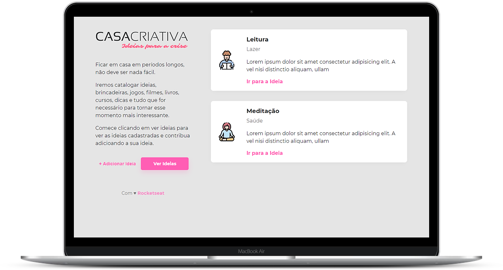

<h1 align="center">
  

</h1>

:rocket: Aplicação web que cadastra atividades para fazer em casa durante o período de quarentena.

  

 

  

## :clapper: Demo
O GIF abaixo mostra o site em ação:

  

## :computer: Tecnologias
- [HTML](https://devdocs.io/html/)
- [CSS](https://devdocs.io/css/)
- [Javascript](https://devdocs.io/javascript/)
- [Node.JS](https://nodejs.org/en/)
- [Nodemon](https://nodemon.io/)
- [Nunjucks](https://mozilla.github.io/nunjucks/)
- [SQLite3](https://www.sqlite.org/index.html)

## :memo: Licença

Esse projeto está sob a licença MIT. Veja o arquivo [LICENSE](/LICENSE) para mais detalhes.
